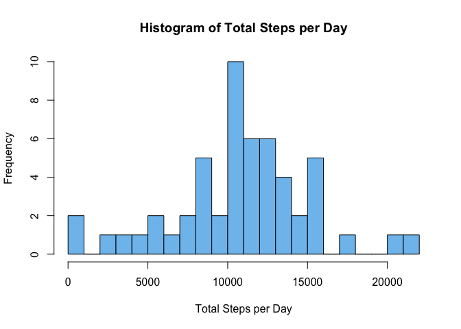
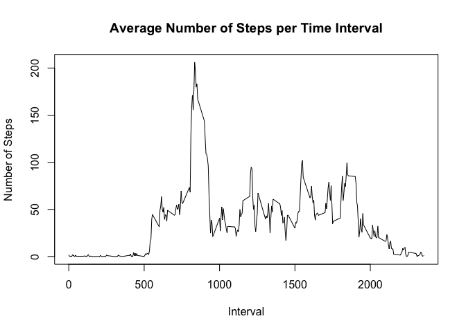
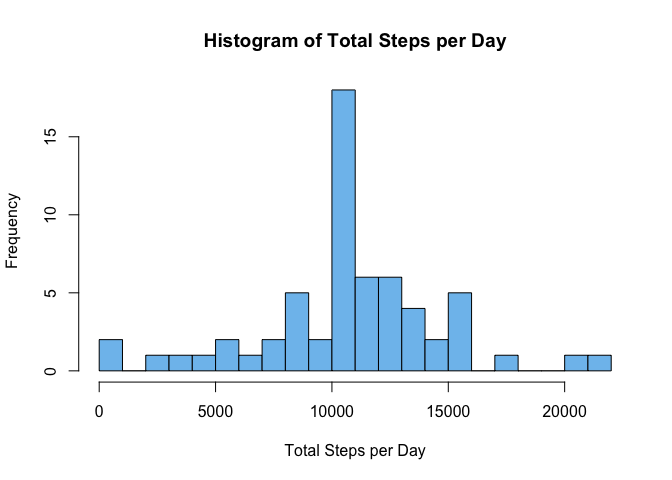
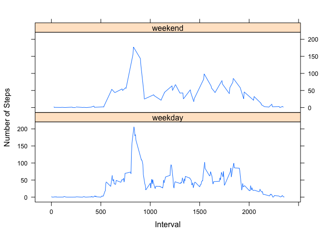

```r
library(reshape2)
library(lattice)
options(digits = 0)
options(scipen = 999)             # turn off scientific notation
```
This assignment makes use of data from a personal activity monitoring device.
This device collects data at 5 minute intervals throughout the day. The data
consists of two months of data from an anonymous individual collected during the
months of October and November, 2012, and includes the number of steps taken in 
5 minute intervals each day.  
<br>

## Loading and preprocessing the data
The data are stored in the file activity.csv, which holds the following variables:  
* **steps:** Number of steps taken in a 5-minute interval (missing values are coded as NA)  
* **date:** The date on which the measurement was taken in YYYY-MM-DD format  
* **interval:** Identifier for the 5-minute interval in which measurement was taken
in HHMM format


```r
# Load csv data into data frame
activity <- read.csv("activity.csv")

# Format $date variable in a proper date format
activity$date <- as.Date(activity$date, format = "%Y-%m-%d")

# Convert data to wide format of interval by date
activity <- dcast(activity, interval ~ date, value.var = "steps")

# Display initial few days of data collected between midnight and 12:25am 
head(activity[1:5])
```

```
##   interval 2012-10-01 2012-10-02 2012-10-03 2012-10-04
## 1        0         NA          0          0         47
## 2        5         NA          0          0          0
## 3       10         NA          0          0          0
## 4       15         NA          0          0          0
## 5       20         NA          0          0          0
## 6       25         NA          0          0          0
```
<br>

## What is the mean total number of steps taken per day?

```r
# Sum all variables (dates) except the first column, 
# which holds the time intervals
dailysteps <- colSums(activity[-1])

# Histogram of results with increased bins for better appearance
hist(dailysteps,
     breaks = 20,
     main = "Histogram of Total Steps per Day",
     xlab = "Total Steps per Day",
     col = "skyblue2")
```

<!-- -->

The mean total number of steps taken per day is: 
10766

```r
mean(dailysteps, na.rm=TRUE)
```
The median total number of steps taken per day is: 
10765

```r
median(dailysteps, na.rm=TRUE)
```
<br>

## What is the average daily activity pattern?
Note that intervals are in the format HHMM without leading zeros,
stored as an integer vector 0, 5, ... 50, 55, 100, 105 ... 2355. Therefore,
line plots where **interval** is the x-axis show jumps between the "55"'s
and "00"'s.

```r
# Create named vector with average steps per time interval
intervalsteps <- rowMeans(activity[-1], na.rm=TRUE)
names(intervalsteps) <- activity$interval

plot(as.numeric(names(intervalsteps)), intervalsteps, 
     main = "Average Number of Steps per Time Interval",
     xlab = "Interval",
     ylab = "Number of Steps",
     type = "l")
```

<!-- -->

The time of day which contains on average, the highest number of steps, is
calculated below:

```r
# Find maximum average steps interval and format as a valid time of day
maxinterval <- as.numeric(names(intervalsteps[which.max(intervalsteps)]))
paste(maxinterval %/% 100, ":", maxinterval %% 100, sep="")
```

```
## [1] "8:35"
```
<br>

## Imputing missing values  
The total number of missing values (NA's) is: 2304

```r
sum(is.na(activity))
```
The missing values are entirely contained within eight of the sixty-one days
measured, each of which returned no data for the entire day:

```r
# Prepare boolean vector of dates entirely missing data
missingdates <- sapply(activity[-1], function(x) {mean(is.na(x)) == 1})

# Print the list of dates with missing data
names(which(missingdates))
```

```
## [1] "2012-10-01" "2012-10-08" "2012-11-01" "2012-11-04" "2012-11-09"
## [6] "2012-11-10" "2012-11-14" "2012-11-30"
```
The missing values could be reasonably imputed by replacing the columns of
missing data with the average numbers of steps for each time interval:

```r
# Replace data from missing days with average steps for each interval
activityfilled <- sapply(activity[-1], function(x) {
                                          if (mean(is.na(x)) == 1) 
                                          {x <- unname(intervalsteps)} 
                                          else {x}
                                          }
                          )

# Replace initial column listing time intervals
activityfilled <- cbind(activity[1], activityfilled)

# Subset of new data frame, 7:30am to 8:15am, showing that NA's from
# Oct 1 and Oct 8 have been replaced with the mean values
activityfilled[91:100, 1:9]
```

```
##     interval 2012-10-01 2012-10-02 2012-10-03 2012-10-04 2012-10-05 2012-10-06
## 91       730         56          0        145        113        126        170
## 92       735         44          0         46        181         30         58
## 93       740         52          0          0         87         19          0
## 94       745         70          0         44          0          8          0
## 95       750         58          0        126          0        171         75
## 96       755         56          0         42          0         68          0
## 97       800         73          0        138         57        114          0
## 98       805         68          0         53         99          0        211
## 99       810        129          0          0        507          9        321
## 100      815        158          0          0        522        122        149
##     2012-10-07 2012-10-08
## 91           0         56
## 92           0         44
## 93          43         52
## 94          40         70
## 95          19         58
## 96          74         56
## 97         121         73
## 98          73         68
## 99           0        129
## 100         27        158
```
<br>
Result is that the new data frame simply reinforces the original data
(but with higher frequency for the middle bar), since the imputed data
is based on means:

```r
# As above
dailystepsfilled <- colSums(activityfilled[-1])
hist(dailystepsfilled,
     breaks = 20,
     main = "Histogram of Total Steps per Day",
     xlab = "Total Steps per Day",
     col = "skyblue2")
```

<!-- -->

The mean total number of steps taken per day is still: 
10766  
The median total number of steps taken per day is still: 
10766
<br><br>

## Are there differences in activity patterns between weekdays and weekends?
A vector was created storing the classification of each date by weekend
or weekday:

```r
# Generates character vector with the original dates as names
daysofweek <- sapply(names(activityfilled[-1]),
                     function(x) {
                       if (weekdays(as.Date(x)) %in%
                           c("Saturday", "Sunday")) {"weekend"}
                       else {"weekday"}
                       }
                     )
head(daysofweek)
```

```
## 2012-10-01 2012-10-02 2012-10-03 2012-10-04 2012-10-05 2012-10-06 
##  "weekday"  "weekday"  "weekday"  "weekday"  "weekday"  "weekend"
```
<br>
Separate plots of the weekend vs the weekday data by time interval indicate that
the subject's average number of steps were not much different over the course of
the day between weekends and weekdays:

```r
xyplot(rowMeans(activityfilled[-1]) ~ activityfilled$interval | daysofweek,
       type = "l",
       layout = c(1,2),
       xlab = "Interval",
       ylab = "Number of Steps")
```

<!-- -->
